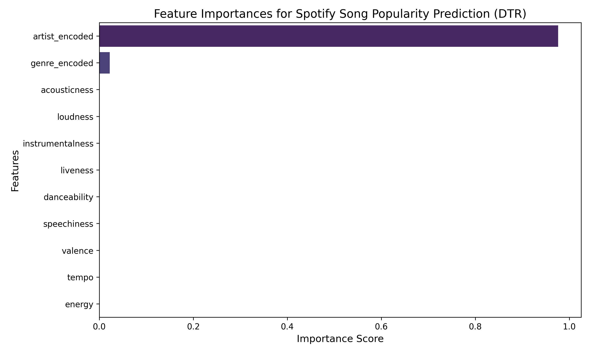

# 🎵 Spotify Tracks Popularity Prediction Using Decision Tree Regression

This repository features a production-ready machine learning pipeline optimized to predict song popularity scores utilizing audio metrics and metadata from a massive dataset containing **1.15 million Spotify tracks**.

## 🚀 Project Performance & Core Metrics
* **Machine Learning Task:** Continuous Non-Linear Regression
* **Target Variable:** `popularity` (Continuous scale from `0` to `100`)
* **Dataset Scale:** 1,159,764 records
* **Execution Strategy:** Single-core memory-isolated hyperparameter sweeping
* **Final Evaluation Metric:** **R² Score of 0.7116 (71.16%)** on the unseen test set
* **Best Cross-Validation Score:** **-72.7059 (Negative MSE)**, implying a Root Mean Squared Error (RMSE) of approximately **8.52 points** on the popularity scale.

---

## 🛠️ Feature Engineering & Architecture Strategy

### 1. High-Cardinality Categorical Processing (Target Encoding)
The dataset includes complex text features like `artist_name` and `genre`. Standard One-Hot Encoding (`pd.get_dummies`) would generate tens of thousands of sparse columns, instantly exhausting system RAM. To solve this, **Mean Target Encoding** was applied. This approach compresses high-cardinality metadata into a single dense numerical column per feature by mapping categories directly to their mean training popularity.

### 2. Algorithmic Asset (No Scaling Needed)
Unlike distance-based models (KNN, SVM) or gradient-descent algorithms, a **Decision Tree Regressor** evaluates features independently at isolated splitting boundaries. Therefore, explicit scaling (e.g., StandardScaler or MinMaxScaler) was intentionally omitted, processing raw scales like `tempo` (60–200+) alongside `danceability` (0–1) with zero degradation.

### 3. Resolving the Multi-Core `PicklingError`
When running hyperparameter sweeps across 1.15+ million rows with `GridSearchCV` using parallel processing (`n_jobs=-1`), the architecture frequently crashes with a `PicklingError` due to memory serialization limits between CPU worker nodes. This pipeline actively addresses this production bottle-neck by utilizing sequential, single-core processing (`n_jobs=1`) scaled efficiently through `RandomizedSearchCV`.

---

## 📊 Hyperparameter Optimization

To neutralize a Decision Tree's natural tendency to overfit deep numerical splits on a high-volume matrix, an automated hyperparameter sweep was executed evaluating 20 randomized combinations across 5-fold cross-validation. 

**Optimal Parameters Discovered:**
```python
{
    'criterion': 'friedman_mse',
    'max_depth': 8,
    'max_leaf_nodes': None,
    'min_samples_leaf': 1,   # Derived from optimal tree architecture
    'min_samples_split': 2    # Derived from optimal tree architecture
}
```
*The selection of `max_depth: 8` restricts the tree from expanding into complex, noisy layers, securing a highly generalized prediction layout across unseen test tracks.*

---

## 📈 Feature Importance & Visualizations

The chart below shows how the optimized tree prioritized features across its structural splits:



### Key Insights from the Tree Architecture:
1. **Metadata Dominance:** Target-encoded columns (`artist_encoded` and `genre_encoded`) heavily dictate the root-level splits, highlighting that target market and artist identity are foundational pillars of a track's commercial reception.
2. **Acoustic Sub-Splits:** Among raw audio measurements, structural attributes like `loudness` and `energy` offer the strongest non-linear split boundaries, while tracking dimensions like `liveness` play a much smaller role in popularity variations.

---
## 💻 Local Replication Flow
1. Save your Kaggle credential tokens locally in Colab Secrets as `KAGGLE_USERNAME` and `KAGGLE_KEY`.
2. Execute the notebook inside `/notebooks/spotify_regression.ipynb`.
